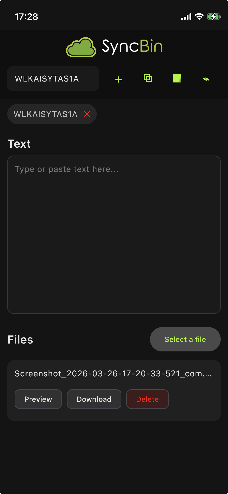
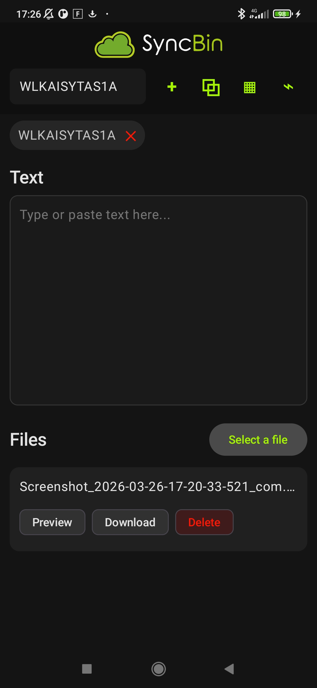

# SyncBin

This is a KMP mobile application.

## The core functionality
SyncBin allows real-time sharing of text and files across multiple devices and platforms.

## What is a session
Sessions are like buckets. They're easily sharable.
Each session has a text field and a file upload area. Users can type and edit the same text from any 
device accessing the session as well as upload, download and delete files attached to the session.